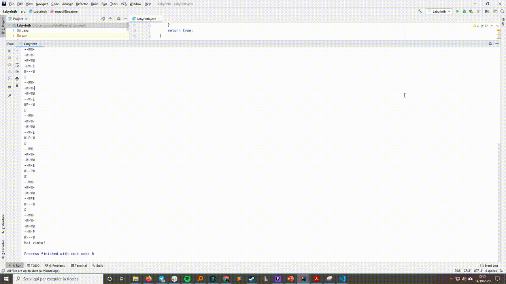

# Labyrinth

Negli anni 80 molti videogiochi :video_game: avevano una grafica "testuale" e cioè usavano i caratteri base del computer per disegnare a schermo.

Possiamo rappresentare un labirinto come una matrice di caratteri, in cui il carattere "-" rappresenta uno spazio vuoto, la "P" la posizione del giocatore e la "E" l’uscita.

Scrivete un programma che permette ad un utente di giocare al vostro labirinto. Per farlo potrà scrivere sulla console di java le lettere «WASD» per muoversi (come in molti videogiochi per PC). Quando il giocatore raggiunge il traguardo, verrà avvisato di aver vinto e il programma termina.

## Esempio di come funziona

## :smiling_face_with_three_hearts: Bonus stage:

Generate il labirinto randomicamente

# :skull_and_crossbones: Ultra mega bonus stage:
## Io ve lo dico, è difficile...
Fate in modo che il computer sia in grado di risolvere da solo il labirinto.
