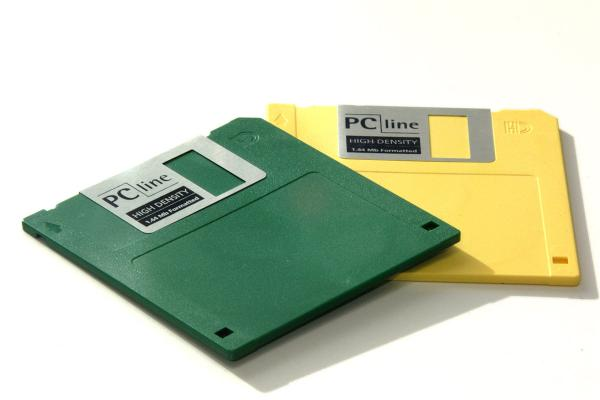

# Floppy disk 2,5" 🛵

Il floppy disk è un supporto magnetico che contiene dati e
può essere acceduto in lettura e scrittura.
Implementare un floppy disk da 2.5 pollici, ovvero con una
capacità pari a 1.474.560 bytes (ovvero 1.44 MB).
Il floppy disk possiede anche un blocco scrittura che è
possibile attivare o disattivare; questo meccanismo, se
attivato, impedisce la scrittura di dati.

Implementare inoltre i seguenti metodi:
- `posizionaTestina()`: posiziona la testina in posizione k-esima
- `leggi()`: legge i prossimi x byte
- `scrivi()`: scrive i byte passati in input
- `formatta()`: cancella tutti i dati presenti sul floppy disk
- `attivaBloccoScrittura()`: attiva il blocco scrittura
- `disattivaBloccoScrittura()`: disattiva il blocco scrittura

Prevedere inoltre tutte le situazioni di errore, ad esempio:
- se si cerca di scrivere o formattare mentre è presente il blocco
scrittura
- se si cerca di scrivere ma il disco è pieno
- si cerca di leggere ma non sono presenti sufficienti dati sul disco